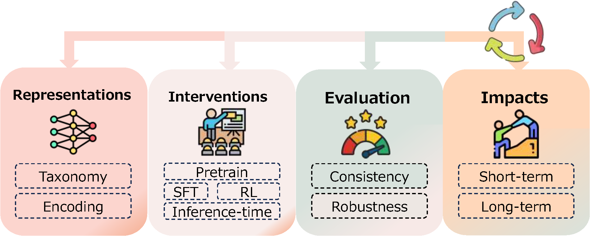

# Awesome-Value-Alignment
A curated collection of resources and practical guidelines on Value Alignment research.

## Structure

## Representations

### Value Taxonomy

- [2018-11] AI4People—An Ethical Framework for a Good AI Society: Opportunities, Risks, Principles, and Recommendations ([Pdf](https://link.springer.com/content/pdf/10.1007/s11023-018-9482-5.pdf))

- [2020-10] Artificial intelligence, values, and alignment ([Pdf](https://link.springer.com/content/pdf/10.1007/s11023-020-09539-2.pdf))

- [2023-09] From Instructions to Intrinsic Human Values--A Survey of Alignment Goals for Big Models ([Pdf](https://arxiv.org/pdf/2308.12014), [Code](https://github.com/ValueCompass/Alignment-Goal-Survey))

- [2023-07] Interim Measures for the Management of Generative Artificial Intelligence Services (2023)(Translation) ([Translation](https://www.chinalawtranslate.com/en/generative-ai-interim/), [Source](https://www.cac.gov.cn/2023-07/13/c_1690898327029107.htm))

- [2023-06] Artificial Intelligence Act ([Pdf](https://www.europarl.europa.eu/doceo/document/TA-9-2023-0236_EN.pdf))

- [2023-01] Artificial intelligence risk management framework (AI RMF 1.0) ([Pdf](https://nvlpubs.nist.gov/nistpubs/ai/nist.ai.100-1.pdf))

- [2019-02] Social Principles of Human-Centric AI ([Pdf](https://www.cas.go.jp/jp/seisaku/jinkouchinou/pdf/humancentricai.pdf))

- [2023-10] The State of Implementation of the OECD AI Principles Four Years On ([Pdf](https://oecd-ai.case-api.buddyweb.fr/storage/policy-initiatives/Jul2025/fu_s2cdv9y6354q9jt.pdf))

- [2019-10] AI principles: recommendations on the ethical use of artificial intelligence by the department of defense ([Pdf](https://www.aiaa.org/wp-content/uploads/2024/12/DIB_AI_PRINCIPLES_PRIMARY_DOCUMENT.pdf))

- [2023-08] A pro-innovation approach to AI regulation ([Pdf](https://assets.publishing.service.gov.uk/media/64cb71a547915a00142a91c4/a-pro-innovation-approach-to-ai-regulation-amended-web-ready.pdf))

- [2025-08] Global AI Governance Action Plan ([Full text](https://www.fmprc.gov.cn/eng./xw/zyxw/202507/t20250729_11679232.html))

- [2023-11] Biasasker: Measuring the bias in conversational ai system ([Pdf](https://arxiv.org/pdf/2305.12434), [Code](https://github.com/yxwan123/BiasAsker))

- [2025-01] Explicitly unbiased large language models still form biased associations ([Pdf](https://www.pnas.org/doi/epdf/10.1073/pnas.2416228122), [Code](https://github.com/baixuechunzi/llm-implicit-bias))

- [2025-07] Moralbench: Moral evaluation of llms ([Pdf](https://arxiv.org/pdf/2406.04428), [Code](https://github.com/agiresearch/MoralBench))

- [2022-05] Challenges and strategies in cross-cultural NLP ([Pdf](https://aclanthology.org/2022.acl-long.482.pdf))

- [2025-09] LinguaSafe: A Comprehensive Multilingual Safety Benchmark for Large Language Models ([Pdf](https://arxiv.org/pdf/2508.12733), [Code](https://github.com/telegraph-pole-head/LinguaSafe), [Dataset](https://huggingface.co/datasets/telegraphpolehead/linguasafe))

- [2013-12] Value sensitive design and information systems ([Paper](https://link.springer.com/chapter/10.1007/978-94-007-7844-3_4))

- [1996-03] Values in life role choices and outcomes: A conceptual model ([Paper](https://onlinelibrary.wiley.com/doi/abs/10.1002/j.2161-0045.1996.tb00252.x))

- [1992-12] Universals in the content and structure of values: Theoretical advances and empirical tests in 20 countries ([Paper](https://www.sciencedirect.com/science/article/abs/pii/S0065260108602816))

- [1974-06] The nature of human values ([Paper](https://academic.oup.com/psq/article-abstract/89/2/399/7165933))

### Value Encoding

- [2025-04] High-Dimension Human Value Representation in Large Language Models ([Pdf](https://aclanthology.org/2025.naacl-long.274.pdf))

- [2025-07] Revisiting LLM Value Probing Strategies: Are They Robust and Expressive? ([Pdf](https://arxiv.org/pdf/2507.13490))

- [2025-07] Improving Preference Extraction In LLMs By Identifying Latent Knowledge Through Classifying Probes ([Pdf](https://aclanthology.org/2025.acl-long.444.pdf), [Code](https://github.com/maiush/LP-as-a-Judge))

- [2023-07] Evaluating the Moral Beliefs Encoded in LLMs ([Pdf](https://proceedings.neurips.cc/paper_files/paper/2023/file/a2cf225ba392627529efef14dc857e22-Paper-Conference.pdf), [Code](https://proceedings.neurips.cc/paper_files/paper/2023/file/a2cf225ba392627529efef14dc857e22-Paper-Conference.pdf), [Dataset](https://huggingface.co/datasets/ninoscherrer/moralchoice))

- [2024-03] Non-Linear Inference Time Intervention: Improving LLM Truthfulness ([Pdf](https://arxiv.org/pdf/2403.18680), [Code](https://github.com/Samsung/NL-ITI))

## Interventions

### Pretrain
- [2024-12] Alignment at Pre-training! Towards Native Alignment for Arabic LLMs ([Pdf](https://arxiv.org/abs/2412.03253), [Code](https://github.com/FreedomIntelligence/AceGPT-v2))

### SFT
- [2023-08] Self-Alignment with Instruction Backtranslation ([Pdf](https://arxiv.org/abs/2308.06259))
- [2024-08] Value Alignment from Unstructured Text ([Pdf](https://www.arxiv.org/abs/2408.10392))
- [2025-03] Teaching AI to Handle Exceptions: Supervised Fine-Tuning with Human-Aligned Judgment ([Pdf](https://arxiv.org/abs/2503.02976))

### RLXF
- [2022-03] Training language models to follow instructions with human feedback ([Pdf](https://arxiv.org/abs/2203.02155))
- [2022-12] Constitutional AI: Harmlessness from AI Feedback ([Pdf](https://arxiv.org/abs/2212.08073))
- [2023-05] Language Model Self-improvement by Reinforcement Learning Contemplation ([Pdf](https://arxiv.org/abs/2305.14483))
- [2023-06] Judging LLM-as-a-Judge with MT-Bench and Chatbot Arena([Pdf](https://arxiv.org/abs/2306.05685))
- [2023-09] RLAIF vs. RLHF: Scaling Reinforcement Learning from Human Feedback with AI Feedback ([Pdf](https://arxiv.org/abs/2309.00267))
- [2024-01] Self-Rewarding Language Models ([Pdf](https://arxiv.org/abs/2401.10020))
- [2024-03] HRLAIF: Improvements in Helpfulness and Harmlessness in Open-domain Reinforcement Learning From AI Feedback ([Pdf](https://arxiv.org/abs/2403.08309))
- [2024-05] RLSF: Fine-tuning LLMs via Symbolic Feedback ([Pdf](https://arxiv.org/abs/2405.16661))
- [2024-08] Self-Taught Evaluators ([Pdf](https://arxiv.org/abs/2408.02666))
- [2024-08] Generative Verifiers: Reward Modeling as Next-Token Prediction ([Pdf](https://arxiv.org/abs/2408.15240))
- [2024-10] Generative Reward Models ([Pdf](https://arxiv.org/abs/2410.12832))
- [2025-01] Learning to Plan & Reason for Evaluation with Thinking-LLM-as-a-Judge ([Pdf](https://arxiv.org/abs/2501.18099))
- [2025-01] DeepSeek-R1: Incentivizing Reasoning Capability in LLMs via Reinforcement Learning ([Pdf](https://arxiv.org/abs/2501.12948))
- [2025-03] Crossing the Reward Bridge: Expanding RL with Verifiable Rewards Across Diverse Domains ([Pdf](https://arxiv.org/abs/2503.23829))
- [2025-03] Beyond Verifiable Rewards: Scaling Reinforcement Learning for Language Models to Unverifiable Data ([Pdf](https://arxiv.org/abs/2503.19618v2))
- [2025-03] R-PRM: Reasoning-Driven Process Reward Modeling ([Pdf](https://arxiv.org/abs/2503.21295))
- [2025-04] Inference-Time Scaling for Generalist Reward Modeling ([Pdf](https://arxiv.org/abs/2504.02495))
- [2025-04] Process Reward Models That Think ([Pdf](https://arxiv.org/abs/2504.16828))
- [2025-04] TTRL: Test-Time Reinforcement Learning ([Pdf](https://arxiv.org/abs/2504.16084))
- [2025-05] Reinforcing General Reasoning without Verifiers ([Pdf](https://arxiv.org/abs/2505.21493))
- [2025-05] J1: Incentivizing Thinking in LLM-as-a-Judge via Reinforcement Learning ([Pdf](https://arxiv.org/abs/2505.10320))
- [2025-05] RM-R1: Reward Modeling as Reasoning ([Pdf](https://arxiv.org/abs/2505.02387))
- [2025-05] General-Reasoner: Advancing LLM Reasoning Across All Domains ([Pdf](https://arxiv.org/abs/2505.14652))
- [2025-05] X-Reasoner: Towards Generalizable Reasoning Across Modalities and Domains ([Pdf](https://arxiv.org/abs/2505.03981))
- [2025-05] Absolute Zero: Reinforced Self-play Reasoning with Zero Data([Pdf](https://arxiv.org/abs/2505.03335))
- [2025-05] Learning to Reason without External Rewards ([Pdf](https://arxiv.org/abs/2505.19590))
- [2025-06] RLPR: Extrapolating RLVR to General Domains without Verifiers ([Pdf](https://arxiv.org/abs/2506.18254))
- [2025-06] RewardAnything: Generalizable Principle-Following Reward Models ([Pdf](https://arxiv.org/abs/2506.03637))
- [2025-06] Writing-Zero: Bridge the Gap Between Non-verifiable Tasks and Verifiable Rewards ([Pdf](https://arxiv.org/abs/2506.00103))
- [2025-06] Generalist Reward Models: Found Inside Large Language Models ([Pdf](https://arxiv.org/abs/2506.23235))
- [2025-07] Rubrics as Rewards: Reinforcement Learning Beyond Verifiable Domains ([Pdf](https://arxiv.org/abs/2507.17746))

### Inference-time
- [2023-12] Llama Guard: LLM-based Input-Output Safeguard for Human-AI Conversations ([Pdf](https://arxiv.org/abs/2312.06674))
- [2025-05] Advancing LLM Safe Alignment with Safety Representation Ranking ([Pdf](https://arxiv.org/abs/2505.15710))

## Evaluations
- [2020-08] Aligning AI With Shared Human Values ([Pdf](https://arxiv.org/abs/2008.02275))
- [2020-08] Scruples: A Corpus of Community Ethical Judgments on 32,000 Real-Life Anecdotes ([Pdf](https://arxiv.org/abs/2008.09094))
- [2020-11] Social Chemistry 101: Learning to Reason about Social and Moral Norms ([Pdf](https://arxiv.org/abs/2011.00620))
- [2022-04] The Moral Integrity Corpus: A Benchmark for Ethical Dialogue Systems ([Pdf](https://arxiv.org/abs/2204.03021))
- [2022-09] Moral Mimicry: Large Language Models Produce Moral Rationalizations Tailored to Political Identity ([Pdf](https://arxiv.org/abs/2209.12106))
- [2022-10] When to Make Exceptions: Exploring Language Models as Accounts of Human Moral Judgment ([Pdf](http://arxiv.org/abs/2210.01478))
- [2023-06] Towards Measuring the Representation of Subjective Global Opinions in Language Models ([Pdf](https://arxiv.org/abs/2306.16388))
- [2023-07] Evaluating the Moral Beliefs Encoded in LLMs ([Pdf](https://arxiv.org/abs/2307.14324))
- [2023-11] Flames: Benchmarking Value Alignment of LLMs in Chinese ([Pdf](https://arxiv.org/abs/2311.06899))
- [2023-11] Value FULCRA: Mapping Large Language Models to the Multidimensional Spectrum of Basic Human Values ([Pdf](https://aclanthology.org/2024.naacl-long.486/))
- [2024-02] KorNAT: LLM Alignment Benchmark for Korean Social Values and Common Knowledge ([Pdf](https://arxiv.org/abs/2402.13605))
- [2024-06] MoralBench: Moral Evaluation of LLMs ([Pdf](https://arxiv.org/abs/2406.04428))
- [2025-01] Mind the Value-Action Gap: Do LLMs Act in Alignment with Their Values? ([Pdf](https://arxiv.org/abs/2501.15463))
- [2025-08] Beyond Benchmark: LLMs Evaluation with an Anthropomorphic and Value-oriented Roadmap ([Pdf](https://arxiv.org/abs/2508.18646))
- [2025-09] EigenBench: A Comparative Behavioral Measure of Value Alignment ([Pdf](https://arxiv.org/abs/2509.01938))

## Impacts 

- [2025-04] The role of large language models in personalized learning: a systematic review of educational impact ([Pdf](https://link.springer.com/content/pdf/10.1007/s43621-025-01094-z.pdf))

- [2025-01] Chain of Risks Evaluation (CORE): A framework for safer large language models in public mental health ([Pdf](https://onlinelibrary.wiley.com/doi/epdf/10.1111/pcn.13781))

- [2024-07] AI generates covertly racist decisions about people based on their dialect ([Pdf](https://www.nature.com/articles/s41586-024-07856-5.pdf))

- [2025-03] Large language models can consistently generate high-quality content for election disinformation operations ([Full text](https://journals.plos.org/plosone/article?id=10.1371/journal.pone.0317421))

- [2025-05] Large Language Models Are More Persuasive Than Incentivized Human Persuaders ([Pdf](https://arxiv.org/pdf/2505.09662))

- [2024-11] Persuasion with large language models: a survey ([Pdf](https://arxiv.org/pdf/2411.06837))

- [2025-06] Agentic Misalignment: How LLMs Could be an Insider Threat ([Full text](https://www.anthropic.com/research/agentic-misalignment), [Code](https://github.com/anthropic-experimental/agentic-misalignment))

- [2025-09] Base models beat aligned models at randomness and creativity ([Pdf](https://arxiv.org/pdf/2505.00047))

- [2024-02] Understanding the Effects of RLHF on LLM Generalisation and Diversity ([Pdf](https://arxiv.org/pdf/2310.06452), [Code](https://github.com/facebookresearch/rlfh-gen-div))

- [2025-05] Tradeoffs Between Alignment and Helpfulness in Language Models with Representation Engineering ([Pdf](https://arxiv.org/pdf/2401.16332), [Code](https://github.com/dorin133/REPE_alignment_helpfulness_tradeoff))

- [2025-06] Safety Tax: Safety Alignment Makes Your Large Reasoning Models Less Reasonable ([Pdf](https://arxiv.org/pdf/2503.00555), [Code](https://github.com/git-disl/Safety-Tax))

- [2025-06] Moral disagreement and the limits of AI value alignment: a dual challenge of epistemic justification and political legitimacy ([Pdf](https://link.springer.com/content/pdf/10.1007/s00146-025-02427-2.pdf))

- [2025-08] Rethinking responsible AI from ethical pillars to sociotechnical practice ([Pdf](https://link.springer.com/content/pdf/10.1007/s43681-025-00809-2.pdf))

- [2025-01] Reinforcement Learning from Human Feedback: Whose Culture, Whose Values, Whose Perspectives? ([Pdf](https://arxiv.org/pdf/2407.17482))

- [2025-04] Understanding the LLM-ification of CHI: Unpacking the Impact of LLMs at CHI through a Systematic Literature Review ([Pdf](https://dl.acm.org/doi/pdf/10.1145/3706598.3713726), [Code](https://llm-ification.github.io))

- [2024-09] Value alignment without institutional change cannot prevent the societal risks of Artificial Intelligence ([Full text](https://ppr.lse.ac.uk/articles/10.31389/lseppr.113))